## 🧑‍💻 Tiago Silva

**`Desenvolvedor FullStack`**

Me chamo Tiago Silva Rufiniano, tenho 27 anos e sou natural do Espírito Santo. Concluí o ensino médio na EEEM Godofredo Schneider e possuo graduação em Análise e Desenvolvimento de Sistemas pela Faculdade Estácio de Sá.

Tenho grande interesse pela área de tecnologia e utilizo meu GitHub para praticar, desenvolver projetos e construir minha própria documentação técnica, acompanhando minha evolução e aprimorando continuamente a forma como escrevo meus códigos.

    
    
    

---

### 🤖 Linguagens e Tecnologias

 
 

### 📊 Estatísticas

  
  

